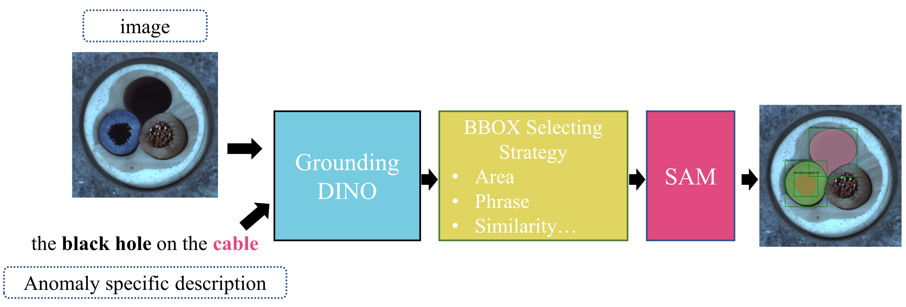
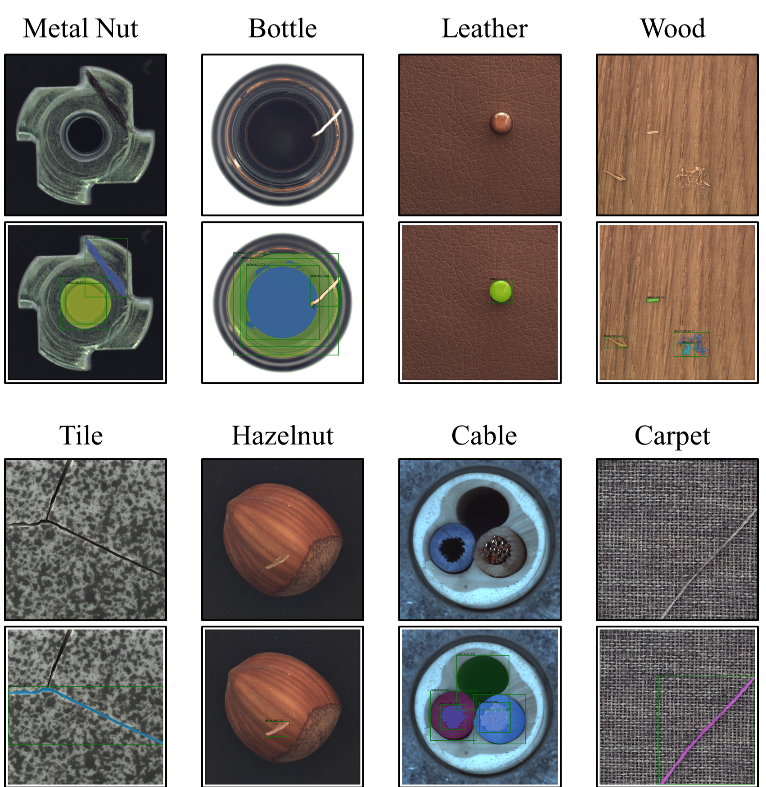
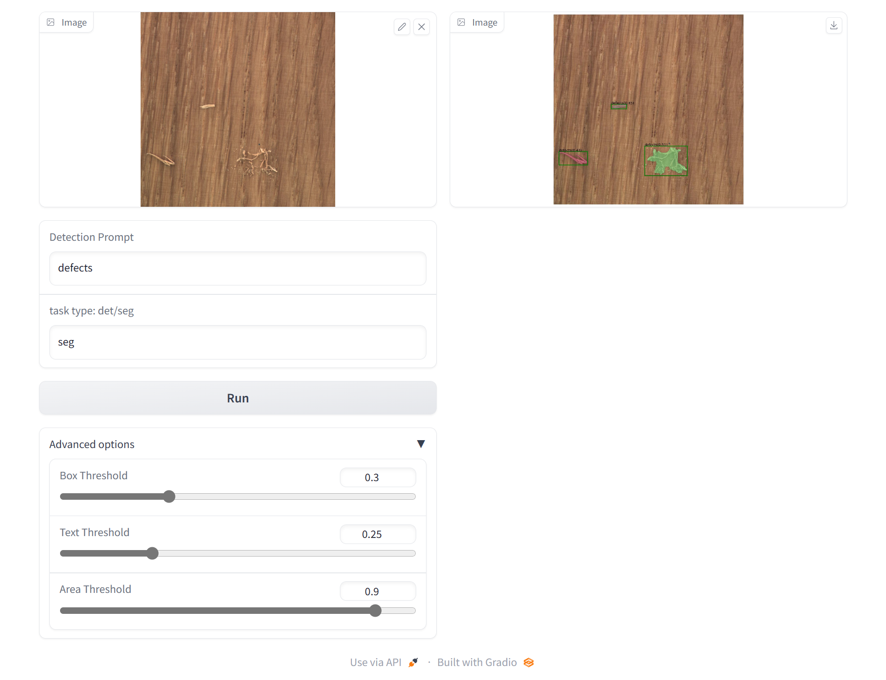

# GroundedSAM-zero-shot-anomaly-detection

This project aims to segment any anomaly without any training. We develop this interesting demo by combining [Grounding DINO](https://github.com/IDEA-Research/GroundingDINO) and [Segment Anything](https://github.com/facebookresearch/segment-anything)!
Most of the codes are borrowed from [Grounded Segment Anything](https://github.com/IDEA-Research/Grounded-Segment-Anything). Thanks to their excellent work!

**Why this project?**

- [Segment Anything](https://github.com/facebookresearch/segment-anything) is a strong segmentation model. But it need prompts (like boxes/points) to generate masks.
- [Grounding DINO](https://github.com/IDEA-Research/GroundingDINO) is a strong zero-shot detector which enable to generate high quality boxes and labels with free-form text.
- The combination of the two models enable to **detect and segment everything** with text inputs!
- In real world industrial inspection applications, models trained with zero or few normal images, is essential in many cases as defects are rare with a wide range of variations.


**How we do?**

We feed the origin image and anomaly specific description to Grouding DINO, and then filter the bouding boxes using several
strategies. Then the filtered bounding boxes are denoted as the prompts in SAM for final anomaly segmentation.



**Imagine Space**

Some possible avenues for future work ...

- Stronger foundation models with segmentation pre-training.
- Collaboration with (Chat-)GPT.
- More advanced normality- and abnormality-specific prompts for better zero-shot anomaly detection performance.

**Examples on the MVTec AD dataset**



## :fire: What's New 

- 🆕 Show the way of using anomaly specific prompts to detect anomalies more precise.

[comment]: <> (  )


[comment]: <> (- :new: Checkout our related human-face-edit branch [here]&#40;https://github.com/IDEA-Research/Grounded-Segment-Anything/tree/humanFace&#41;. We'll keep updating this branch with more interesting features. Here are some examples:)

[comment]: <> (  ![]&#40;https://github.com/IDEA-Research/Grounded-Segment-Anything/blob/humanFace/assets/231-hair-edit.png&#41;)


## 🛠 Installation

The code requires `python>=3.8`, as well as `pytorch>=1.7` and `torchvision>=0.8`. Please follow the instructions [here](https://pytorch.org/get-started/locally/) to install both PyTorch and TorchVision dependencies. Installing both PyTorch and TorchVision with CUDA(>=11.1) support is strongly recommended.

Install Segment Anything:

```bash
python -m pip install -e segment_anything
```

Install GroundingDINO:

```bash
python -m pip install -e GroundingDINO
```

The following optional dependencies are necessary for mask post-processing, saving masks in COCO format, the example notebooks, and exporting the model in ONNX format. `jupyter` is also required to run the example notebooks.

```
pip install opencv-python pycocotools matplotlib onnxruntime onnx ipykernel
```

More details can be found in [install segment anything](https://github.com/facebookresearch/segment-anything#installation) and [install GroundingDINO](https://github.com/IDEA-Research/GroundingDINO#install)

## 🏃 Run Grounded-Segment-Anything Demo

- Download the checkpoint for segment-anything and grounding-dino:

```bash
cd $ProjectRoot
mkdir weights
cd ./weights
wget https://dl.fbaipublicfiles.com/segment_anything/sam_vit_h_4b8939.pth
wget https://github.com/IDEA-Research/GroundingDINO/releases/download/v0.1.0-alpha/groundingdino_swint_ogc.pth
```

- Run demo

```bash
export CUDA_VISIBLE_DEVICES=0
python zero_shot_ad_demo.py \
  --config GroundingDINO/groundingdino/config/GroundingDINO_SwinT_OGC.py \
  --grounded_checkpoint weights/groundingdino_swint_ogc.pth \
  --input_image assets/wood_demo.png \
  --output_dir "outputs" \
  --box_threshold 0.15 \
  --text_threshold 0.15 \
  --area_threshold 0.70 \
  --text_prompt "defects" \
  --device "cuda"
```

- The model prediction visualization will be saved in `output_dir`.

## 🏃 Run Grounded-Segment-Anything + Gradio APP

```bash
python gradio_zero_shot_ad_app.py
```

- The gradio app visulization as follow:


## :hammer:Todolist
We will add following features in the near future...
- [x] Detail the zero-shot anomaly detection framework.
- [ ] Evaluate on other image anomaly detection datasets.
- [ ] Add video demo.
- [x] Add UI for easy evaluation.
- [ ] Colab demo.
- [ ] HuggingFace demo.


## :cupid: Acknowledgements

- [segment-anything](https://github.com/facebookresearch/segment-anything)
- [GroundingDINO](https://github.com/IDEA-Research/GroundingDINO)
- [Grounded Segment Anything](https://github.com/IDEA-Research/Grounded-Segment-Anything)


## :fireworks:Related Work

If you feel good about our work, there are some work you might be interested in：

- [Awesome-segment-anything-extensions](https://github.com/JerryX1110/awesome-segment-anything-extensions)
- [IKD, image anomaly detection](https://github.com/caoyunkang/IKD)
- [CDO, image anomaly detection](https://github.com/caoyunkang/CDO)
- [PFM, image anomaly detection](https://github.com/smiler96/PFM-and-PEFM-for-Image-Anomaly-Detection-and-Segmentation)
- [GCPF, image anomaly detection](https://github.com/smiler96/GCPF)
- [CPMF, point cloud anomaly detection](https://github.com/caoyunkang/CPMF)
- [awesome-industrial-anomaly-detection, survey of anomaly detection](https://github.com/M-3LAB/awesome-industrial-anomaly-detection)

## Citation

If you find this project helpful for your research, please consider citing the following BibTeX entry.

```BibTex
@article{kirillov2023segany,
  title={Segment Anything}, 
  author={Kirillov, Alexander and Mintun, Eric and Ravi, Nikhila and Mao, Hanzi and Rolland, Chloe and Gustafson, Laura and Xiao, Tete and Whitehead, Spencer and Berg, Alexander C. and Lo, Wan-Yen and Doll{\'a}r, Piotr and Girshick, Ross},
  journal={arXiv:2304.02643},
  year={2023}
}

@inproceedings{ShilongLiu2023GroundingDM,
  title={Grounding DINO: Marrying DINO with Grounded Pre-Training for Open-Set Object Detection},
  author={Shilong Liu and Zhaoyang Zeng and Tianhe Ren and Feng Li and Hao Zhang and Jie Yang and Chunyuan Li and Jianwei Yang and Hang Su and Jun Zhu and Lei Zhang},
  year={2023}
}
```
